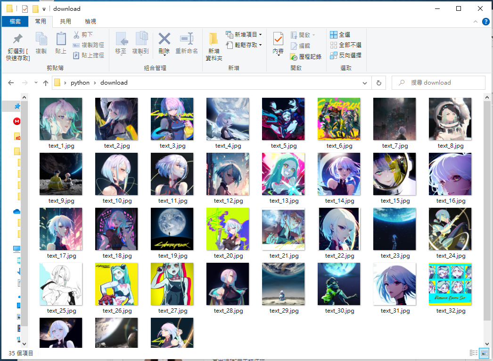
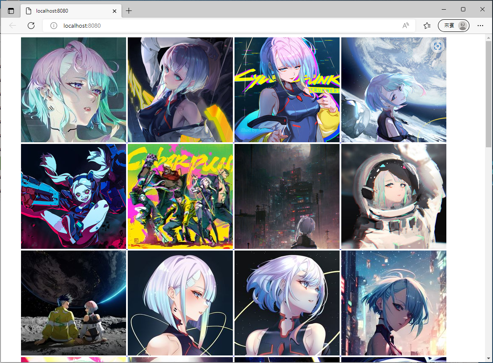

# 用python爬蟲模擬pixiv網站熱門搜尋功能之可行性
## 前言
本專案僅作為本人面試工作時展示作品之用，功能及介面還相當簡陋。
如真的想要使用pixiv的熱門搜尋功能，建議還是直接買個會員比較快。
## 使用方法
pixiv_get 此程式功能為將爬取到的插畫以原圖尺寸下載到download資料夾內。  
* 呈現示意圖:
{:width="50%"}
***
pixiv_web 此程式功能為將爬取的內容以網站得方式呈現，每張圖點進去都會連結到該圖片的pixiv網站。  
* 呈現示意圖:

